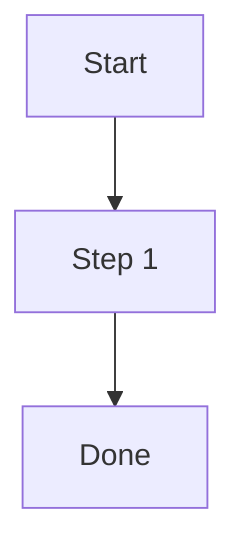

# Blog Writing Guide — JSBlogs

This document defines the standards and conventions for writing blog posts on **JSBlogs** (blogs.jsbisht.com). Follow these guidelines to maintain consistency across all posts.

---

## 1. File Naming

- Place all posts in `src/data/blog/`.
- Use **kebab-case** filenames ending in `.md`.
- The filename becomes the URL slug: `my-post-title.md` → `/blog/my-post-title`.
- Keep filenames **concise but descriptive** — avoid filler words like "a", "the", "an".
- Use hyphens (`-`), never underscores or spaces.

**Examples:**
```
getting-started-with-graphql.md          ✅
spring-boot-auto-configuration-tutorial.md  ✅
My Blog Post.md                          ❌
spring_session_plugin.md                 ❌
```

---

## 2. Frontmatter

Every post **must** begin with a YAML frontmatter block. All dates must be quoted ISO 8601 strings.

### Required Fields

| Field         | Type     | Description                                |
|---------------|----------|--------------------------------------------|
| `title`       | string   | Post title (sentence case recommended)     |
| `description` | string   | 1–2 sentence summary for SEO and previews  |
| `pubDatetime`  | string   | Publish date in ISO 8601 (quoted)         |
| `tags`        | string[] | At least one tag (see Tag Standards below) |

### Optional Fields

| Field          | Type            | Default            | Description                              |
|----------------|-----------------|---------------------|------------------------------------------|
| `author`       | string          | `"Jitendra Singh Bisht"` | Override the default author        |
| `modDatetime`  | string \| null  | —                   | Last modified date (ISO 8601, quoted)    |
| `featured`     | boolean         | `false`             | Pin to homepage featured section         |
| `draft`        | boolean         | `false`             | Hide from production (still builds locally) |
| `ogImage`      | string          | —                   | Custom Open Graph image path (see Images)|
| `canonicalURL` | string          | —                   | Canonical URL if cross-posted elsewhere  |
| `hideEditPost` | boolean         | `false`             | Hide "Suggest edit" link                 |
| `timezone`     | string          | `"Asia/Kolkata"` | Timezone for date display               |

### Template

```yaml
---
title: Your Post Title Here
description: A concise description of what this post covers, used for SEO and social cards.
pubDatetime: "2026-03-15T00:00:00-04:00"
tags:
  - java
  - spring
ogImage: /images/cards/your-image.png
---
```

### Date Format Rules

- Always **quote** dates: `"2026-03-15T00:00:00-04:00"` (not `2026-03-15T00:00:00-04:00`).
- Include timezone offset (e.g., `-04:00` for EDT, `-05:00` for EST).
- When updating a post, add/update `modDatetime` and keep the original `pubDatetime` unchanged.

---

## 3. Tag Standards

Tags drive the `/tags/[tag]` pages and help readers discover related content. Use only **lowercase kebab-case** tags.

### Established Tags (use these before creating new ones)

| Tag               | Use for                                     |
|-------------------|---------------------------------------------|
| `java`            | Any Java-related content                    |
| `spring`          | Spring Framework core                       |
| `springboot`      | Spring Boot specific content                |
| `spring-security` | Authentication, authorization with Spring   |
| `spring-session`  | Spring Session topics                       |
| `spring-beans`    | Bean lifecycle, scopes, configuration       |
| `oauth2`          | OAuth 2.0 flows and implementations        |
| `jwt`             | JSON Web Token topics                       |
| `json`            | JSON parsing, serialization                 |
| `jackson`         | Jackson library specifics                   |
| `gson`            | Gson library specifics                      |
| `graphql`         | GraphQL topics                              |
| `grails`          | Grails framework                            |
| `collections`     | Java Collections framework                  |
| `optional`        | Java Optional                               |
| `azure-ad`        | Azure Active Directory / Entra ID           |
| `rest-api`        | REST API design and implementation          |
| `web-security`    | General web security topics                 |
| `lombok`          | Project Lombok                              |
| `angular-js`      | AngularJS frontend                          |
| `blogs`           | Meta / general blog posts                   |

### Tag Rules

1. **Every post must have at least one tag.** If none apply, use `others` (the schema default).
2. **Reuse existing tags** before creating new ones — check the list above.
3. **Use specific tags over generic ones** — prefer `springboot` over just `java` when the post is Spring Boot–focused (but include both if relevant).
4. **Limit to 2–4 tags** per post. Don't over-tag.
5. **Never use uppercase or spaces** — use `azure-ad` not `Azure AD`.
6. **Version-specific tags** (e.g., `java9`, `java10`) are acceptable for "what's new" posts.

---

## 4. Content Structure

### Opening

Start with a **brief introduction** (2–4 sentences) that tells the reader:
- What the post covers.
- Why it matters or when they'd need it.
- Any prerequisites or assumed knowledge.

Do **not** start with "In this blog post, I will…" — get to the point.

### Table of Contents

Add this line after the introduction to auto-generate a TOC:

```markdown
## Table of contents
```

AstroPaper automatically generates the TOC from `##` and `###` headings. Use it for posts with **3+ sections**.

### Headings

- Use `##` for major sections, `###` for subsections.
- **Never use `#`** (h1) — the post title is already h1.
- Use **sentence case**: "Getting started with GraphQL" not "Getting Started With GraphQL".
- Number sections when order matters (e.g., step-by-step tutorials): `## 1. Setup`, `## 2. Configuration`.

### Paragraphs

- Keep paragraphs **short** — 2–4 sentences max.
- Use blank lines between paragraphs.
- Prefer active voice: "Spring creates the bean" not "The bean is created by Spring".

---

## 5. Code Blocks

### Inline Code

Use backticks for class names, method names, field names, annotations, file paths, and short code references:

```markdown
The `@Autowired` annotation tells Spring to inject the `UserService` bean.
```

### Fenced Code Blocks

Always specify the **language identifier** for syntax highlighting:

````markdown
```java
public class UserService {
    private final UserRepository repository;
}
```
````

**Supported languages:** `java`, `kotlin`, `xml`, `yaml`, `json`, `bash`, `sql`, `typescript`, `javascript`, `html`, `css`, `groovy`, `properties`, `text`

### Code Block Rules

1. **Use inline code blocks** — do not embed external gists. This keeps content self-contained and avoids broken links.
2. **Keep examples minimal** — show only the relevant code. Remove boilerplate imports unless they are the point.
3. **Add comments sparingly** — only where the code isn't self-explanatory.
4. **Use realistic names** — `UserService`, `OrderRepository` not `Foo`, `Bar`, `MyClass`.
5. **Show complete, runnable snippets** when possible — readers should be able to copy-paste.

### XML / POM Snippets

For Maven dependencies, show only the `<dependency>` block (not the entire POM):

```xml
<dependency>
    <groupId>org.projectlombok</groupId>
    <artifactId>lombok</artifactId>
    <version>1.18.42</version>
    <scope>provided</scope>
</dependency>
```

---

## 6. Diagrams

Diagrams are rendered client-side using **Mermaid**. Use them to clarify architecture, flows, and comparisons that are hard to convey in prose.

### Syntax

Wrap the diagram definition in a fenced code block with the `mermaid` language identifier:

````markdown

````

### Supported diagram types

| Type | Identifier | Best for |
|---|---|---|
| Flowchart | `flowchart TD` / `flowchart LR` | Pipelines, decision trees, migration paths |
| Sequence | `sequenceDiagram` | API calls, auth flows, request/response cycles |
| State | `stateDiagram-v2` | State machines, lifecycle phases |
| Class | `classDiagram` | Object models, inheritance hierarchies |

Use `flowchart TD` (top-down) for step-by-step processes and `flowchart LR` (left-right) for data flows between parallel components.

### Line breaks in node labels

Use `<br/>` for line breaks inside node labels — `\n` is not processed:

```
B["Step 1: Upgrade to 3.5.x<br/>Fix deprecation warnings"]   ✅
B["Step 1: Upgrade to 3.5.x\nFix deprecation warnings"]      ❌
```

### Subgraph labels

Keep subgraph labels **short**. Long labels overflow and overlap nodes in `LR` layout:

```
subgraph cg ["Consumer Group"]                              ✅
subgraph cg ["Consumer Group — one partition per consumer"] ❌
```

Move the description to the surrounding paragraph text instead.

### Avoid unicode special characters

Mermaid's parser can choke on unicode symbols. Use plain ASCII alternatives:

| Avoid | Use instead |
|---|---|
| ① ② ③ ④ | Step 1, Step 2… |
| `·` (middle dot) | `,` or `/` |
| `✓` `✗` | Done, Failed |
| `→` `←` | Use Mermaid arrow syntax (`-->`) |

### Critical: do not place diagrams under `## Table of contents`

The blog uses `remark-toc` + `remark-collapse`, which **replaces all content** under a heading named `Table of contents` with auto-generated links. Any diagram placed there will be silently removed.

Always put diagrams under their own descriptive heading:

```markdown
## Table of contents     ← auto-generates TOC links here (leave empty)

## Migration Roadmap     ← put your diagram here

```

### When to add a diagram

Add a diagram when any of the following is true:
- The concept involves **3+ steps** in a defined order (flowchart).
- You're showing how **two or more systems communicate** (sequence diagram).
- The content has a **state machine** with transitions (state diagram).
- A table or paragraph would need more than 5 sentences to explain the same thing.

Skip the diagram if the code example already makes the flow obvious.

---

## 7. Images

### Storage

- Store all images in `public/images/` under a **topic subdirectory**:
  ```
  public/images/java/java-32.png
  public/images/spring/spring-security-oauth2.png
  public/images/cards/auto-config-spring-boot.jpg
  ```
- Use `public/images/cards/` for post-specific OG/card images.

### Referencing in Posts

Reference images with **root-relative paths** (no `public/` prefix):

```markdown

```

### OG Images

- Set `ogImage` in frontmatter to a root-relative path: `ogImage: /images/cards/your-image.png`
- Recommended dimensions: **1200×630px** for social sharing.
- If omitted, the blog auto-generates a dynamic OG image from the title and description.

### Image Rules

1. **Optimize images** before adding — compress PNGs/JPGs. Aim for < 200KB per image.
2. **Use descriptive alt text** — `` not ``.
3. **Use PNG** for diagrams and screenshots, **JPG** for photos.
4. Avoid excessively wide images — **max width ~1200px**.

---

## 8. Links

### Internal Links

Link to other blog posts using the `/blog/[slug]` path:

```markdown
Check out the [Spring Boot Auto-Configuration Tutorial](/blog/spring-boot-auto-configuration-tutorial).
```

Do **not** use full URLs for internal links — always use root-relative paths.

### External Links

Use descriptive link text (not "click here"):

```markdown
See the [official Lombok documentation](https://projectlombok.org/features/) for the full feature list.
```

---

## 9. Formatting Conventions

| Element           | Convention                                              |
|-------------------|---------------------------------------------------------|
| Bold              | **Key terms** on first use, **important warnings**      |
| Italic            | *Emphasis*, book/spec titles                            |
| Lists             | Use `-` for unordered, `1.` for ordered                 |
| Blockquotes       | `>` for callouts, notes, or quoting external sources    |
| Horizontal rules  | `---` to separate major topic shifts within a section   |
| Tables            | Use for structured comparisons (features, configs)      |

### Notes and Warnings

Use blockquotes with bold labels:

```markdown
> **Note:** This feature requires Spring Boot 3.0 or later.

> **Warning:** Enabling this in production will expose debug endpoints.
```

For color callouts in JSBlogs, use these reusable classes:

```html
<blockquote class="callout callout-tip">
  <p><strong>Tip:</strong> Keep one versioning strategy across services.</p>
</blockquote>

<blockquote class="callout callout-important">
  <p><strong>Important:</strong> Add tests for each API version.</p>
</blockquote>

<blockquote class="callout callout-caution">
  <p><strong>Caution:</strong> Removing fields can break existing clients.</p>
</blockquote>

<blockquote class="callout callout-note">
  <p><strong>Note:</strong> Retire old versions on a fixed sunset date.</p>
</blockquote>
```

---

## 10. Drafts

- Set `draft: true` in frontmatter to hide a post from production.
- Drafts are still built locally — use `npm run dev` to preview them.
- Remove or set `draft: false` when ready to publish.

---

## 11. Pre-Publish Checklist

Before marking a post as non-draft, verify:

- [ ] **Frontmatter is complete** — title, description, pubDatetime, tags all present.
- [ ] **Dates are quoted** — `"2026-03-15T00:00:00-04:00"` with timezone offset.
- [ ] **Tags exist** — reused from established list or intentionally new.
- [ ] **Code blocks have language identifiers** — no bare ``` blocks.
- [ ] **Images are optimized** and stored in `public/images/[topic]/`.
- [ ] **Links work** — internal links use `/blog/[slug]`, external links point to live pages.
- [ ] **No broken embeds** — use inline code, not gist/external script embeds.
- [ ] **Diagrams render correctly** — no unicode special chars, no `\n` in labels (use `<br/>`), subgraph labels are short, diagram is not placed under `## Table of contents`.
- [ ] **Description is meaningful** — not just the title repeated; think SEO.
- [ ] **Spell check done** — especially on class names and technical terms.
- [ ] **Local build passes** — run `npm run build` with no errors.

---

## 12. Build and Preview

```bash
# Install dependencies
npm install

# Local dev server with hot reload
npm run dev

# Full production build (includes Pagefind search index)
npm run build

# Preview the production build locally
npm run preview
```

The build command runs: `astro check && astro build && pagefind --site dist && cp -r dist/pagefind public/`
