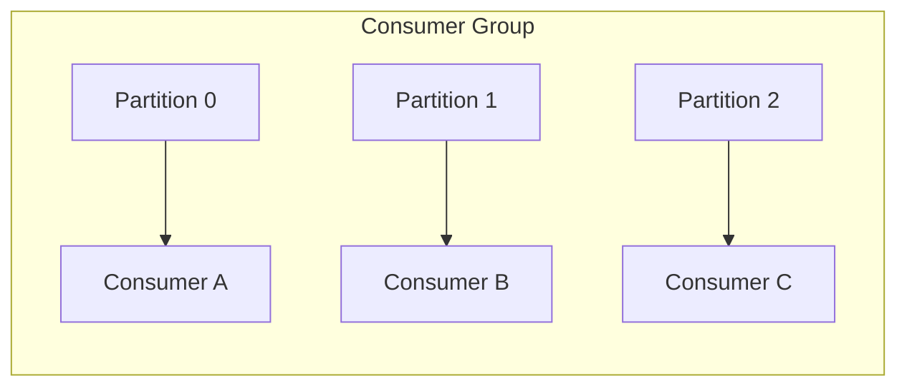
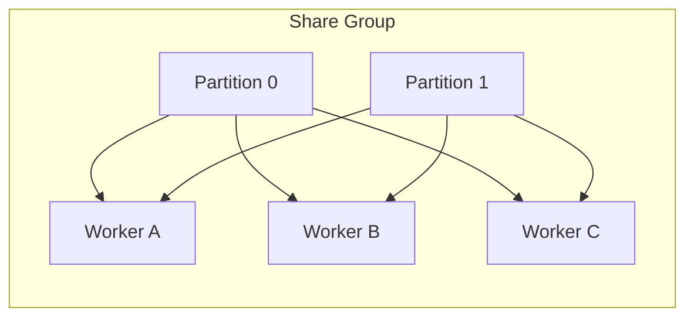
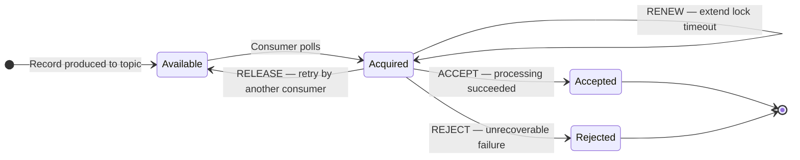
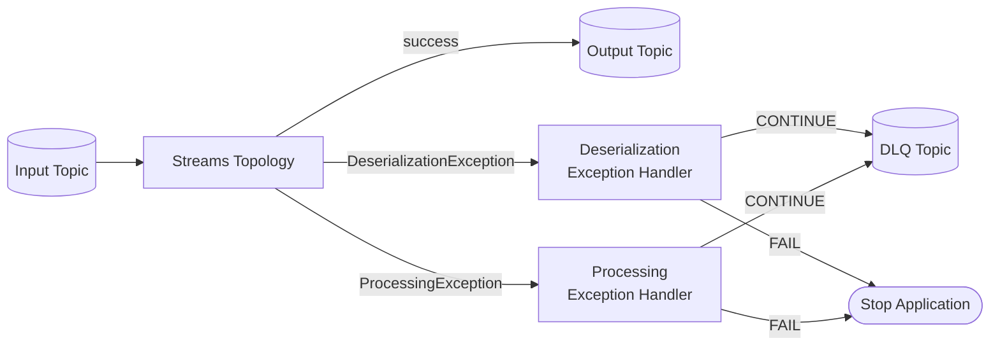

Apache Kafka 4.2 was released on 17 February 2026. The headline is Share Groups — Kafka's native queue-style consumption model — reaching production-ready status after several preview releases. Alongside that, Kafka Streams picks up dead letter queue support and server-side rebalance goes GA, the CLI gets a long-overdue consistency pass, and Java 25 is now supported.

This post covers every meaningful change with the context you need to decide what to adopt now and what to keep an eye on.

## Table of contents

## Share Groups (Kafka Queues) — production ready

Share Groups are the biggest conceptual addition to Kafka's consumption model since consumer groups were introduced. Understanding what problem they solve is the starting point.

### The traditional consumer group model

In a standard consumer group, each partition is assigned exclusively to one consumer at a time. If you want to parallelise processing of a single high-volume partition, your only option is to add more partitions. More partitions mean more coordination overhead, cannot be decreased without data reshuffling, and do not help if records within a partition have ordering dependencies.



### The Share Group model

Share Groups break the exclusive partition ownership contract. Multiple consumers within a share group can all read from the same partition concurrently. Each record is delivered to one consumer for processing, and that consumer acknowledges the outcome explicitly — accepted, released for redelivery, or rejected permanently.



This is the semantics of a message queue (RabbitMQ, SQS) built natively on top of Kafka's log structure. You get fan-out consumption, explicit acknowledgement, and automatic redelivery — without a separate messaging system.

### Using a Share Group in Java

Share Groups use `ShareConsumer` rather than `KafkaConsumer`. The subscription and poll loop look similar; acknowledgement is the key difference.

```java
Properties props = new Properties();
props.put(ConsumerConfig.BOOTSTRAP_SERVERS_CONFIG, "localhost:9092");
props.put(ConsumerConfig.GROUP_ID_CONFIG, "order-processors");
props.put(ConsumerConfig.KEY_DESERIALIZER_CLASS_CONFIG, StringDeserializer.class.getName());
props.put(ConsumerConfig.VALUE_DESERIALIZER_CLASS_CONFIG, StringDeserializer.class.getName());

try (ShareConsumer<String, String> consumer = new ShareConsumer<>(props)) {
    consumer.subscribe(List.of("orders"));

    while (true) {
        ConsumerRecords<String, String> records = consumer.poll(Duration.ofSeconds(1));

        for (ConsumerRecord<String, String> record : records) {
            try {
                processOrder(record.value());
                // Record processed successfully — release offset permanently
                consumer.acknowledge(record, AcknowledgeType.ACCEPT);

            } catch (TransientException e) {
                // Transient failure — release for redelivery to any consumer
                consumer.acknowledge(record, AcknowledgeType.RELEASE);

            } catch (PoisonPillException e) {
                // Unrecoverable — reject permanently (counts against max retries)
                consumer.acknowledge(record, AcknowledgeType.REJECT);
            }
        }

        consumer.commitSync(); // flush acknowledgements to the broker
    }
}
```

### New in 4.2 — the RENEW acknowledgement type (KIP-1222)

Before 4.2, if your processing took longer than the acquisition lock timeout, Kafka would assume the consumer failed and redeliver the record to another consumer — even while the original consumer was still working. The only option was to tune `delivery.timeout.ms` globally.

`AcknowledgeType.RENEW` solves this without tuning: while a record is being processed, you can extend its lock before it expires, then acknowledge when done.

```java
for (ConsumerRecord<String, String> record : records) {
    // Kick off long-running work asynchronously
    CompletableFuture<Void> work = processAsync(record.value());

    // Renew the lock before it expires while work is still running
    scheduler.scheduleAtFixedRate(
        () -> consumer.acknowledge(record, AcknowledgeType.RENEW),
        30, 30, TimeUnit.SECONDS
    );

    work.join(); // wait for completion
    consumer.acknowledge(record, AcknowledgeType.ACCEPT);
}
```

The full lifecycle of a record through a Share Group, including the new RENEW state:



### New in 4.2 — share partition lag metrics (KIP-1226)

Monitoring consumption lag with Share Groups previously required custom tooling. 4.2 adds dedicated lag metrics exposed through JMX and the metrics endpoint:

```
kafka.server:type=ShareGroupMetrics,name=SharePartitionLag,group=order-processors,topic=orders,partition=0
```

These flow into Prometheus/Grafana through the standard Kafka JMX exporter without any additional configuration.

### When to use Share Groups vs Consumer Groups

| | Consumer Groups | Share Groups |
|---|---|---|
| Processing model | Partition-per-consumer, ordered | Any consumer, concurrent |
| Ordering guarantee | Per-partition | Not guaranteed |
| Acknowledgement | Offset commit | Per-record (Accept/Release/Reject) |
| Redelivery | Manual DLQ wiring | Built-in (RELEASE / REJECT) |
| Best for | Event sourcing, ordered streams | Task queues, async job dispatch |

<blockquote class="callout callout-tip">
  <p><strong>Tip:</strong> Share Groups are a good fit when you are currently running a Kafka consumer alongside a separate RabbitMQ or SQS queue for job dispatch. You can consolidate the two into a single Share Group topic, reducing operational surface area while keeping the queue semantics your application code already expects.</p>
</blockquote>

## Kafka Streams improvements

### Dead letter queue support in exception handlers (KIP-1034)

Before 4.2, when a Kafka Streams topology hit a deserialization error or processing failure on a record, the options were: stop the application, skip the record, or write custom error-routing code in every processor. There was no standard mechanism to route failed records to a dedicated topic.

4.2 adds dead letter queue support to both the deserialization exception handler and the processing exception handler.



**Handling deserialization failures:**

```java
public class OrderDeserializationHandler implements DeserializationExceptionHandler {

    @Override
    public DeserializationHandlerResponse handle(
            ErrorHandlerContext context,
            ConsumerRecord<byte[], byte[]> record,
            Exception exception) {

        // Write the raw bytes and headers to a DLQ topic via a side-channel producer
        dlqProducer.send(new ProducerRecord<>(
            "orders.dlq",
            record.key(),
            buildErrorEnvelope(record.value(), exception, context)
        ));

        return DeserializationHandlerResponse.CONTINUE; // skip and keep the topology running
    }
}
```

```java
// Wire it in StreamsConfig
props.put(
    StreamsConfig.DEFAULT_DESERIALIZATION_EXCEPTION_HANDLER_CLASS_CONFIG,
    OrderDeserializationHandler.class
);
```

**Handling processing failures:**

```java
public class OrderProcessingHandler implements ProcessingExceptionHandler {

    @Override
    public ProcessingHandlerResponse handle(
            ErrorHandlerContext context,
            Record<?, ?> record,
            Exception exception) {

        dlqProducer.send(new ProducerRecord<>(
            "orders.processing.dlq",
            serializeKey(record.key()),
            buildErrorEnvelope(record.value(), exception, context)
        ));

        return ProcessingHandlerResponse.CONTINUE;
    }
}
```

<blockquote class="callout callout-important">
  <p><strong>Important:</strong> The DLQ producer in these handlers is managed by your code, not Kafka Streams. Ensure it is thread-safe and that you handle producer errors separately — a DLQ write failure inside an exception handler should not crash the topology.</p>
</blockquote>

### Server-side rebalance protocol — GA (KIP-1071)

The server-side (cooperative) rebalance protocol for Kafka Streams, which moved task assignment from the consumer side to the broker, is now generally available with a stable feature set. This protocol reduces the rebalance scope: only partitions that need to move are reassigned, rather than triggering a stop-the-world rebalance for all consumers whenever membership changes.

```java
// Enable server-side rebalance (recommended for new deployments)
props.put(StreamsConfig.GROUP_PROTOCOL_CONFIG, "streams");
```

For existing deployments on the classic rebalance protocol, migration requires a rolling restart — set the config, redeploy one instance at a time.

### Anchored wall-clock punctuation (KIP-1146)

`PunctuationType.WALL_CLOCK_TIME` punctuations in Kafka Streams previously scheduled the next punctuation relative to the last execution. Over time this drifts — a one-minute punctuation scheduled at 12:00:00 would eventually fire at 12:00:07, then 12:00:14.

4.2 adds anchored scheduling: the first punctuation fires at the next aligned wall-clock time for the given interval, and subsequent firings stay anchored to that grid.

```java
@Override
public void init(ProcessorContext<K, V> context) {
    // Before (relative — drifts over time)
    context.schedule(Duration.ofMinutes(1), PunctuationType.WALL_CLOCK_TIME, ts -> flush());

    // After (anchored — always fires at :00, :01, :02...)
    context.schedule(
        Duration.ofMinutes(1),
        PunctuationType.WALL_CLOCK_TIME,
        Duration.ZERO,   // offset from interval boundary
        ts -> flush()
    );
}
```

This matters for windowing aggregations and periodic flushes where predictable timing affects downstream correctness (e.g. hourly summaries that must align to hour boundaries).

### Fluent CloseOptions API (KIP-1153)

Shutting down a Kafka Streams application previously always sent a leave-group request, causing a rebalance before the application finished closing. For rolling restarts where the same instance will rejoin immediately, this rebalance is unnecessary and adds latency.

```java
// Before — always sends leave-group, always triggers rebalance
streams.close();

// After — control leave-group behaviour and shutdown timeout explicitly
streams.close(new KafkaStreams.CloseOptions()
    .leaveGroup(false)          // skip leave-group for rolling restarts
    .timeout(Duration.ofSeconds(30))
);

// Or: send leave-group explicitly for a clean final shutdown
streams.close(new KafkaStreams.CloseOptions()
    .leaveGroup(true)
    .timeout(Duration.ofSeconds(60))
);
```

<blockquote class="callout callout-tip">
  <p><strong>Tip:</strong> Use <code>leaveGroup(false)</code> in your Kubernetes rolling restart lifecycle hook. The new pod joins before the old one has fully stopped, and the rebalance happens once rather than twice.</p>
</blockquote>

## Observability and metrics

### Metric naming standardisation (KIP-1100)

Kafka's JMX metric names previously mixed naming conventions across components. 4.2 corrects them to follow the `kafka.COMPONENT` pattern consistently. If your Prometheus or Datadog dashboards reference metric names by exact string, review them before upgrading.

The Kafka JMX exporter configuration and Confluent Platform dashboards have been updated to match. Custom dashboards built on raw JMX names will need updating.

### New idle ratio metrics

Two new metrics provide visibility into whether the controller and MetadataLoader are keeping up with work:

- **KIP-1190** — `AvgIdleRatio` for the active controller: a low value (approaching 0.0) means the controller is saturated and metadata operations will lag.
- **KIP-1229** — `AvgIdleRatio` for MetadataLoader: similarly indicates whether metadata propagation to brokers is falling behind.

Add these to your cluster health dashboards alongside existing `RequestHandlerAvgIdlePercent` metrics.

### Generic feature level metrics (KIP-1180)

New JMX metrics expose the finalized, minimum supported, and maximum supported feature level for each Kafka production feature. This makes it easier to track upgrade state across a cluster:

```
kafka.server:type=FeatureMetrics,name=FinalizedFeatureLevel,feature=share-version
kafka.server:type=FeatureMetrics,name=MinSupportedFeatureLevel,feature=share-version
kafka.server:type=FeatureMetrics,name=MaxSupportedFeatureLevel,feature=share-version
```

Useful for validating that a rolling broker upgrade has fully completed before enabling new features.

## Admin API improvements

### Rack ID in member descriptions (KIP-1227)

`AdminClient.describeConsumerGroups()` and `AdminClient.describeShareGroups()` now include the rack ID of each member in the response. This is useful for diagnosing uneven partition assignment across availability zones.

```java
try (AdminClient admin = AdminClient.create(props)) {
    DescribeConsumerGroupsResult result = admin.describeConsumerGroups(
        List.of("order-processors")
    );

    ConsumerGroupDescription description = result.all().get().get("order-processors");

    for (MemberDescription member : description.members()) {
        System.out.printf("Consumer %s is on rack %s%n",
            member.consumerId(),
            member.rackId().orElse("unknown")  // new in 4.2
        );
    }
}
```

## CLI standardisation (KIP-1147)

Most Kafka CLI tools now accept `--bootstrap-server` as the standard broker connection argument. Previously, several tools used `--broker-list`, `--zookeeper`, or other flags — a frequent source of confusion, especially for developers switching between tools.

```bash
# Before — different tools, different flags
kafka-topics.sh --zookeeper localhost:2181 --list                # deprecated
kafka-console-producer.sh --broker-list localhost:9092 --topic orders

# After — consistent across all tools in 4.2
kafka-topics.sh --bootstrap-server localhost:9092 --list
kafka-console-producer.sh --bootstrap-server localhost:9092 --topic orders
kafka-consumer-groups.sh --bootstrap-server localhost:9092 --list
kafka-configs.sh --bootstrap-server localhost:9092 --entity-type brokers --describe
```

<blockquote class="callout callout-caution">
  <p><strong>Caution:</strong> Zookeeper-based CLI flags continue to be deprecated and will be removed in Kafka 5.0. Any automation scripts still using <code>--zookeeper</code> should be updated now — they will stop working in the next major version.</p>
</blockquote>

## JsonConverter external schema support (KIP-1054)

Kafka Connect's `JsonConverter` traditionally embedded the full schema inside every message:

```json
{
  "schema": {
    "type": "struct",
    "fields": [
      { "type": "string", "field": "id" },
      { "type": "int64", "field": "amount" },
      { "type": "string", "field": "currency" }
    ]
  },
  "payload": { "id": "ord-123", "amount": 4999, "currency": "USD" }
}
```

For topics with large or complex schemas, the schema portion can dwarf the payload, wasting storage and network bandwidth.

4.2 adds support for referencing an external schema by ID, reducing the message to payload only:

```json
{ "id": "ord-123", "amount": 4999, "currency": "USD" }
```

Enable it in your connector configuration:

```properties
value.converter=org.apache.kafka.connect.json.JsonConverter
value.converter.schemas.enable=false
value.converter.schema.registry.url=http://schema-registry:8081
```

This is particularly valuable for high-throughput connectors where schema overhead becomes a measurable cost at scale.

## Other notable changes

### Java 25 support

Kafka 4.2 is tested and supported on Java 25 (the latest LTS). The minimum Java version remains Java 11 for clients and Java 17 for brokers.

### Thread-safe RecordHeader (KIP-1205)

`RecordHeader` was not thread-safe — accessing headers from multiple threads required external synchronisation. In 4.2, reads and writes to `RecordHeader` are thread-safe without additional locking. Applications that share header objects across threads no longer need to wrap accesses in `synchronized` blocks.

### Dynamic configuration for remote log manager thread pool (KIP-1179)

For clusters using tiered storage, the thread pool size for the remote log manager can now be updated dynamically without a broker restart:

```bash
kafka-configs.sh --bootstrap-server localhost:9092 \
  --entity-type brokers --entity-default \
  --alter --add-config remote.log.manager.thread.pool.size=8
```

### ConsumerPerformance regex topic filtering (KIP-1192)

The `kafka-consumer-perf-test.sh` tool now accepts a `--topic-regex` flag to subscribe to multiple topics matching a pattern — useful for load testing multiple topic variants at once.

```bash
kafka-consumer-perf-test.sh \
  --bootstrap-server localhost:9092 \
  --topic-regex "orders-.*" \
  --messages 1000000
```

## Deprecations — heading to Kafka 5.0

These are deprecated in 4.2 and will be removed in 5.0:

| Item | Replacement | KIP |
|---|---|---|
| `ConsumerGroupMetadata` constructors | `ConsumerGroupMetadata.of(...)` factory method | KIP-1136 |
| MX4j JMX HTTP adapter | JConsole, JMX exporter, or Jolokia | KIP-1193 |
| `BrokerNotFoundException` | `KafkaException` | KIP-1195 |
| Zookeeper-based CLI flags (`--zookeeper`, `--broker-list`) | `--bootstrap-server` | KIP-1147 |

If you use `ConsumerGroupMetadata` directly in your transaction code, update the construction pattern now:

```java
// Deprecated in 4.2 — removed in 5.0
ConsumerGroupMetadata meta = new ConsumerGroupMetadata(groupId);

// Use instead
ConsumerGroupMetadata meta = new ConsumerGroupMetadata(
    groupId, generationId, memberId, groupInstanceId
);
// Or the new factory method (check 4.2 Javadoc for exact signature)
```

<blockquote class="callout callout-note">
  <p><strong>Note:</strong> MX4j was an open-source JMX HTTP bridge that many older Kafka monitoring setups relied on. If your cluster monitoring still uses MX4j, plan the migration to the Prometheus JMX exporter (<code>jmx_prometheus_javaagent</code>) before Kafka 5.0 removes the adapter entirely.</p>
</blockquote>

## Upgrading to Kafka 4.2

**Broker upgrade:** Rolling upgrade from 4.1 to 4.2 is supported. Upgrade brokers one at a time in KRaft mode — the active controller is automatically transferred during each broker restart.

**Feature flags:** New features that require metadata version upgrades (Share Groups, server-side Streams rebalance) are gated behind feature flags. Enable them explicitly after all brokers are on 4.2:

```bash
# Verify all brokers are on 4.2 before enabling new features
kafka-features.sh --bootstrap-server localhost:9092 describe

# Enable share groups feature level
kafka-features.sh --bootstrap-server localhost:9092 \
  upgrade --feature share-version
```

**Client compatibility:** Kafka clients are forward and backward compatible across two minor versions. Clients on 4.0 or 4.1 will continue to work against a 4.2 broker. `ShareConsumer` requires a 4.2 (or later) client library.

**Spring Kafka:** Spring for Apache Kafka 4.0 (released November 2025 with Spring Boot 4) supports Kafka 4.x. Upgrade `spring-kafka` to `4.0.x` alongside the broker upgrade.

```xml
<!-- Spring Boot 4 manages the version via BOM -->
<dependency>
    <groupId>org.springframework.kafka</groupId>
    <artifactId>spring-kafka</artifactId>
</dependency>
```

<blockquote class="callout callout-tip">
  <p><strong>Tip:</strong> If you are still on Kafka 3.x, upgrading to 4.2 first requires a stop at 4.0 to complete the ZooKeeper-to-KRaft migration if you have not already done so. Kafka 4.0 dropped ZooKeeper support entirely — there is no ZooKeeper mode in 4.x.</p>
</blockquote>

## Feature summary

| Feature | Area | Status |
|---|---|---|
| Share Groups (Kafka Queues) | Consumption | GA |
| RENEW acknowledgement type | Share Groups | New |
| Share partition lag metrics | Observability | New |
| Kafka Streams DLQ support | Streams | New |
| Streams server-side rebalance | Streams | GA |
| Anchored wall-clock punctuation | Streams | New |
| Fluent CloseOptions API | Streams | New |
| Metric naming standardisation | Observability | Improved |
| Controller / MetadataLoader idle metrics | Observability | New |
| Feature level metrics | Observability | New |
| Rack ID in group member descriptions | Admin API | New |
| CLI `--bootstrap-server` standardisation | CLI | Improved |
| JsonConverter external schema | Connect | New |
| Java 25 support | Platform | New |
| Thread-safe RecordHeader | Client | Fixed |
| Dynamic remote log manager config | Storage | New |

## References

- <a href="https://kafka.apache.org/blog/2026/02/17/apache-kafka-4.2.0-release-announcement/" target="_blank" rel="noopener" referrerpolicy="origin">Apache Kafka 4.2.0 Release Announcement — kafka.apache.org</a>
- <a href="https://axonops.com/blog/apache-kafka-4-2-0-is-out/" target="_blank" rel="noopener" referrerpolicy="origin">Apache Kafka 4.2.0 is out — AxonOps</a>
- <a href="https://cwiki.apache.org/confluence/display/KAFKA/Release+Plan+4.2.0" target="_blank" rel="noopener" referrerpolicy="origin">Kafka 4.2.0 Release Plan and KIPs — Apache Confluence</a>
- <a href="https://spring.io/blog/2025/11/18/spring-kafka-4/" target="_blank" rel="noopener" referrerpolicy="origin">Spring for Apache Kafka 4.0.0 GA — spring.io</a>
