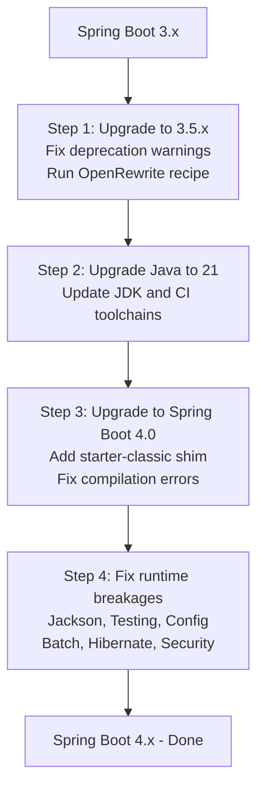

Spring Boot 4.0 is the most significant version bump since the 2.x to 3.x jump. It moves the entire stack to Spring Framework 7, Jakarta EE 11, and Jackson 3 — while also cutting a large backlog of deprecated APIs that accumulated across the 2.x and 3.x lines.

The good news: if you kept up with deprecations in Spring Boot 3.x, most of the compilation errors are already fixed. The bad news: Jackson 3's exception hierarchy change, a handful of renamed configuration properties, and testing annotation shuffles are waiting to bite you even on a clean codebase.

This guide covers every major breakage area and a phase-by-phase plan that lets you migrate without a production outage.

## Table of contents

## Migration Roadmap



## What changed at the platform level

Spring Boot 4.0 raises the floor on everything your application runs on:

| Platform | Spring Boot 3.x | Spring Boot 4.x |
|---|---|---|
| Java minimum | 17 | 17 (21+ recommended) |
| Spring Framework | 6.x | 7.x |
| Jakarta EE | 10 | 11 (Servlet 6.1, JPA 3.2, Bean Validation 3.1) |
| Jackson | 2.x | 3.x |
| Hibernate | 6.x | 7.x |
| Kotlin minimum | 1.9 | 2.2 |
| GraalVM (native) | 22.x | 25+ |

Undertow is removed entirely (explained in detail below). Jersey support is also dropped pending a JAX-RS 4 compatible release.

<blockquote class="callout callout-important">
  <p><strong>Important:</strong> Jakarta EE 11 is fully additive over EE 10 — the <code>jakarta.*</code> namespace migration done in Spring Boot 3.x is still correct. EE 11 adds API versions (<code>Servlet 6.1</code>, <code>JPA 3.2</code>), it does not re-rename packages. You will not need to rename imports again.</p>
</blockquote>

## Phase 1 — Upgrade to Spring Boot 3.5.x first

Do not upgrade directly from an old 3.x version to 4.0. Upgrade to the latest 3.5.x release first.

**Why:** Spring Boot 3.5.x is the last release that marks everything removed in 4.0 as deprecated. It also ships `spring-boot-starter-classic` — a compatibility shim that gives you a working classpath while you fix broken imports in Spring Boot 4.0.

```xml
<!-- Step 1: target the latest 3.5.x -->
<parent>
    <groupId>org.springframework.boot</groupId>
    <artifactId>spring-boot-starter-parent</artifactId>
    <version>3.5.x</version>
</parent>
```

With the project on 3.5.x, enable deprecation warnings in your build and fix every one of them:

```xml
<!-- pom.xml — enable deprecation warnings during compile -->
<plugin>
    <groupId>org.apache.maven.plugins</groupId>
    <artifactId>maven-compiler-plugin</artifactId>
    <configuration>
        <showDeprecation>true</showDeprecation>
        <compilerArgs>
            <arg>-Xlint:deprecation</arg>
        </compilerArgs>
    </configuration>
</plugin>
```

Run the full test suite and fix every deprecation warning before moving on.

<blockquote class="callout callout-tip">
  <p><strong>Tip:</strong> OpenRewrite has recipes that automate a large portion of the Spring Boot 3 to 4 migration — dependency upgrades, property key renames, annotation changes. Run <code>./mvnw rewrite:run -Drewrite.activeRecipes=org.openrewrite.java.spring.boot4.UpgradeSpringBoot_4_0</code> as the first step after landing on 3.5.x to catch mechanical changes automatically.</p>
</blockquote>

## Phase 2 — Upgrade Java to 21

Spring Boot 4 runs on Java 17, but Java 21 is strongly recommended. Virtual threads (stable since Java 21) become significantly more useful on Spring Boot 4 + Spring Framework 7, and 21 is the current LTS.

```xml
<properties>
    <java.version>21</java.version>
</properties>
```

If you are on 17 and not ready to move to 21 yet, 17 will still compile and run. Upgrade anyway — 17 is five releases old and moving to 21 eliminates a major friction point later.

## Phase 3 — Upgrade to Spring Boot 4.0

```xml
<parent>
    <groupId>org.springframework.boot</groupId>
    <artifactId>spring-boot-starter-parent</artifactId>
    <version>4.0.x</version>
</parent>
```

At this point your build will likely fail with compilation errors. The sections below cover every common breakage area.

If you want a working app immediately while you fix errors one area at a time, add the classic starter:

```xml
<!-- Temporary compatibility shim — remove before going to production -->
<dependency>
    <groupId>org.springframework.boot</groupId>
    <artifactId>spring-boot-starter-classic</artifactId>
</dependency>
```

This shim restores removed starters and bridges some API changes. It is not a production configuration — it exists to let you fix problems one module at a time without blocking the whole team.

## Phase 4 — Fix the breakages

### Jackson 3 — the most impactful change

Jackson upgrades from 2.x to 3.x. The Maven group ID changes (`com.fasterxml.jackson` → `tools.jackson`), but the Spring Boot BOM handles that automatically — you do not need to update dependency declarations.

What you do need to fix:

**Exception hierarchy change (compiles but fails at runtime):**

Jackson 2's `JsonProcessingException` extended `IOException`. Jackson 3's `JacksonException` extends `RuntimeException`. Any `catch (IOException e)` block that was also catching Jackson parse errors will silently stop doing so.

```java
// Spring Boot 3 (Jackson 2) — works
try {
    return objectMapper.readValue(json, MyDto.class);
} catch (IOException e) {   // catches both IO and Jackson errors
    log.error("Failed to parse", e);
    return null;
}

// Spring Boot 4 (Jackson 3) — Jackson errors escape this catch block
try {
    return objectMapper.readValue(json, MyDto.class);
} catch (IOException e) {         // only catches real IO errors now
    log.error("IO failure", e);
    return null;
} catch (JacksonException e) {    // explicitly catch Jackson 3 errors
    log.error("Parse failure", e);
    return null;
}
```

Search your codebase for every `catch (IOException` and `catch (Exception` block that wraps `objectMapper` calls and verify they handle `JacksonException` explicitly.

**Renamed customizer:**

```java
// Spring Boot 3
@Bean
Jackson2ObjectMapperBuilderCustomizer customizer() {
    return builder -> builder.featuresToEnable(SerializationFeature.INDENT_OUTPUT);
}

// Spring Boot 4
@Bean
JsonMapperBuilderCustomizer customizer() {
    return builder -> builder.enable(SerializationFeature.INDENT_OUTPUT);
}
```

**Renamed annotation:**

```java
// Spring Boot 3
@JsonComponent
public class MoneySerializer extends JsonSerializer<Money> { ... }

// Spring Boot 4
@JacksonComponent
public class MoneySerializer extends JsonSerializer<Money> { ... }
```

<blockquote class="callout callout-caution">
  <p><strong>Caution:</strong> The Jackson exception change is a silent runtime failure — it compiles cleanly and your tests may still pass if they do not hit the exception path. Add tests that deliberately provide malformed JSON to each parsing boundary to verify error handling works after migration.</p>
</blockquote>

### Undertow removed

Spring Boot 4 requires Servlet 6.1, which Undertow does not yet support. If you declared the Undertow starter, remove it and use Tomcat (default) or Jetty:

```xml
<!-- Remove this -->
<dependency>
    <groupId>org.springframework.boot</groupId>
    <artifactId>spring-boot-starter-undertow</artifactId>
</dependency>

<!-- Tomcat is the default — no explicit dependency needed -->
<!-- For Jetty: -->
<dependency>
    <groupId>org.springframework.boot</groupId>
    <artifactId>spring-boot-starter-jetty</artifactId>
</dependency>
```

### Testing annotations renamed

`@MockBean` and `@SpyBean` are deprecated in Spring Boot 4 in favour of `@MockitoBean` and `@MockitoSpyBean`. The old annotations still compile but will be removed in a future release — migrate them now.

```java
// Spring Boot 3
@SpringBootTest
class OrderServiceTest {
    @MockBean
    PaymentGateway paymentGateway;

    @SpyBean
    OrderRepository orderRepository;
}

// Spring Boot 4
@SpringBootTest
class OrderServiceTest {
    @MockitoBean
    PaymentGateway paymentGateway;

    @MockitoSpyBean
    OrderRepository orderRepository;
}
```

### SpringBootTest no longer auto-configures MockMVC

`@SpringBootTest` previously auto-wired MockMVC into your test context. In Spring Boot 4 you opt in explicitly:

```java
// Spring Boot 3 — MockMVC was available automatically in a @SpringBootTest
@SpringBootTest

// Spring Boot 4 — add @AutoConfigureMockMvc
@SpringBootTest
@AutoConfigureMockMvc
class MyControllerTest {
    @Autowired
    MockMvc mockMvc;
}
```

Same pattern for `TestRestTemplate`:

```java
@SpringBootTest(webEnvironment = SpringBootTest.WebEnvironment.RANDOM_PORT)
@AutoConfigureTestRestTemplate
class MyApiTest {
    @Autowired
    TestRestTemplate restTemplate;
}
```

### Configuration property renames

Several properties moved namespaces. Your application will start but will ignore the old keys silently — check for `NoSuchBeanDefinitionException` or unexpected behaviours in session, messaging, and data.

| Old key (Spring Boot 3.x) | New key (Spring Boot 4.x) |
|---|---|
| `spring.session.redis.*` | `spring.session.data.redis.*` |
| `spring.session.mongodb.*` | `spring.session.data.mongodb.*` |
| `spring.kafka.retry.topic.backoff.random` | `spring.kafka.retry.topic.backoff.jitter` |

Run `./mvnw spring-boot:run` with `--debug` and scan the output for `UnknownPropertyException` or deprecation notices in the configuration binding phase.

<blockquote class="callout callout-tip">
  <p><strong>Tip:</strong> Enable the configuration processor in your IDE. IntelliJ IDEA and VS Code both highlight unknown or deprecated configuration keys in <code>application.yml</code> when the Spring Boot configuration metadata is on the classpath.</p>
</blockquote>

### Spring Batch — in-memory by default

Spring Batch in Spring Boot 4.x uses an in-memory job repository by default. In Spring Boot 3.x, a datasource on the classpath would trigger the JDBC-backed repository automatically.

If you rely on database-backed job state (restartability, step tracking, history), explicitly add the JDBC starter:

```xml
<dependency>
    <groupId>org.springframework.boot</groupId>
    <artifactId>spring-boot-starter-batch-jdbc</artifactId>
</dependency>
```

Without this, jobs still run — but job execution records are not persisted, and restart-from-failure no longer works.

### Hibernate — annotation processor renamed

If you use the JPA metamodel generator (`_` classes for Criteria API), the artifact name changed:

```xml
<!-- Spring Boot 3 -->
<dependency>
    <groupId>org.hibernate.orm</groupId>
    <artifactId>hibernate-jpamodelgen</artifactId>
    <scope>provided</scope>
</dependency>

<!-- Spring Boot 4 -->
<dependency>
    <groupId>org.hibernate.orm</groupId>
    <artifactId>hibernate-processor</artifactId>
    <scope>provided</scope>
</dependency>
```

### Elasticsearch — Rest5Client

The Elasticsearch client was upgraded to the Elasticsearch 9.x generation, which uses `Rest5Client` instead of `RestClient`.

```java
// Spring Boot 3
@Autowired
RestClient elasticsearchClient;

// Spring Boot 4
@Autowired
Rest5Client elasticsearchClient;
```

If you only interact with Elasticsearch through Spring Data's `ElasticsearchOperations` or `ElasticsearchRepository`, no change is required — the abstraction layer handles this automatically.

### Actuator endpoints — check your exposure config

Spring Boot 4 does not change which endpoints are exposed by default, but 88% of deprecated actuator configuration keys were removed. Verify your `management.*` properties are still valid and restart the app in debug mode to confirm the expected endpoints are reachable.

```yaml
# Explicit exposure — good practice regardless of Spring Boot version
management:
  endpoints:
    web:
      exposure:
        include: health,info,metrics,prometheus
  endpoint:
    health:
      show-details: when-authorized
```

## Spring Framework 7 — nullability annotations

Spring Framework 7 adopts JSpecify (`org.jspecify.annotations`) as the standard for nullability annotations, replacing the Spring-specific `@Nullable` and `@NonNull` from `org.springframework.lang`.

This is only a concern if you are extending Spring internals, writing custom Spring components that override annotated methods, or using Kotlin with strict null checks. If you are not hitting compilation errors from nullability annotations, you can ignore this for now.

## Automated migration with OpenRewrite

OpenRewrite can automate a significant portion of this migration — dependency updates, property key renames, `@JsonComponent` → `@JacksonComponent`, `@MockBean` → `@MockitoBean`, and more.

```xml
<!-- pom.xml — add the plugin -->
<plugin>
    <groupId>org.openrewrite.maven</groupId>
    <artifactId>rewrite-maven-plugin</artifactId>
    <version>5.46.0</version>
    <configuration>
        <activeRecipes>
            <recipe>org.openrewrite.java.spring.boot4.UpgradeSpringBoot_4_0</recipe>
        </activeRecipes>
    </configuration>
    <dependencies>
        <dependency>
            <groupId>org.openrewrite.recipe</groupId>
            <artifactId>rewrite-spring</artifactId>
            <version>5.26.0</version>
        </dependency>
    </dependencies>
</plugin>
```

```bash
./mvnw rewrite:run
```

Review the diff before committing — OpenRewrite's changes are correct but should be understood, not blindly accepted. Run your test suite immediately after applying the recipe.

<blockquote class="callout callout-important">
  <p><strong>Important:</strong> OpenRewrite covers mechanical changes — renames, import updates, deprecated API replacements. It does not catch the Jackson exception hierarchy change or the Spring Batch default change, which require runtime testing to validate.</p>
</blockquote>

## Rollback-safe rollout strategy

Migrating a production service to a major framework version in one shot is risky. A safer approach:

**1. Canary first**
Route 5–10% of production traffic to the migrated version for at least 24 hours. Monitor error rates, latency, and memory usage — not just successful responses.

**2. Parallel run for batch jobs**
If you run Spring Batch jobs, run the migrated version in parallel with the old version for one or two cycles before cutting over. Batch jobs are the highest-risk area because the default change (in-memory vs JDBC) can silently lose job history.

**3. Feature flags for changed behaviours**
If you changed security configuration or session behaviour, put the changes behind a feature flag. This lets you toggle the old behaviour on for specific users or environments if an issue is discovered post-deploy.

**4. Watch for these silent failures post-deploy**
- Jackson parse errors escaping `IOException` catch blocks
- Session data not persisting after Redis property rename
- Batch job restart failures (in-memory job repository)
- Actuator endpoints not responding (removed configuration keys)

## Migration checklist

**Before starting:**
- [ ] Upgrade to Spring Boot 3.5.x
- [ ] Fix all deprecation warnings (`-Xlint:deprecation`)
- [ ] Ensure Java 17+ (21 recommended)
- [ ] Run OpenRewrite Spring Boot 4.0 recipe on 3.5.x codebase

**Compilation fixes:**
- [ ] Replace `Jackson2ObjectMapperBuilderCustomizer` with `JsonMapperBuilderCustomizer`
- [ ] Replace `@JsonComponent` with `@JacksonComponent`
- [ ] Replace `hibernate-jpamodelgen` with `hibernate-processor`
- [ ] Remove `spring-boot-starter-undertow` (switch to Tomcat or Jetty)

**Test fixes:**
- [ ] Replace `@MockBean` with `@MockitoBean`
- [ ] Replace `@SpyBean` with `@MockitoSpyBean`
- [ ] Add `@AutoConfigureMockMvc` to `@SpringBootTest` tests that inject `MockMvc`
- [ ] Add `@AutoConfigureTestRestTemplate` where `TestRestTemplate` is injected

**Configuration fixes:**
- [ ] Rename `spring.session.redis.*` → `spring.session.data.redis.*`
- [ ] Rename `spring.session.mongodb.*` → `spring.session.data.mongodb.*`
- [ ] Rename Kafka backoff property if used
- [ ] Add `spring-boot-starter-batch-jdbc` if JDBC job repository is required

**Runtime verification:**
- [ ] Write/run tests that trigger Jackson parse errors and verify they are caught
- [ ] Confirm Elasticsearch autowired type compiles (if using low-level client)
- [ ] Confirm actuator endpoints respond correctly
- [ ] Verify batch job history is persisted if restart capability is needed

<blockquote class="callout callout-note">
  <p><strong>Note:</strong> Most teams that stayed current with Spring Boot 3.x deprecations report that this migration takes one to three days for a mid-sized service. The Jackson exception change and the batch default change are the two most common surprises that appear in staging and not in the unit test run.</p>
</blockquote>

## References

- <a href="https://github.com/spring-projects/spring-boot/wiki/Spring-Boot-4.0-Migration-Guide" target="_blank" rel="noopener" referrerpolicy="origin">Spring Boot 4.0 Migration Guide — official</a>
- <a href="https://spring.io/blog/2025/11/20/spring-boot-4-0-0-available-now/" target="_blank" rel="noopener" referrerpolicy="origin">Spring Boot 4.0 release announcement</a>
- <a href="https://spring.io/blog/2025/11/13/spring-framework-7-0-general-availability/" target="_blank" rel="noopener" referrerpolicy="origin">Spring Framework 7.0 GA announcement</a>
- <a href="https://docs.spring.io/spring-boot/upgrading.html" target="_blank" rel="noopener" referrerpolicy="origin">Upgrading Spring Boot — official docs</a>
- <a href="https://www.moderne.ai/blog/spring-boot-4x-migration-guide" target="_blank" rel="noopener" referrerpolicy="origin">Spring Boot 4.x migration with OpenRewrite — Moderne</a>
